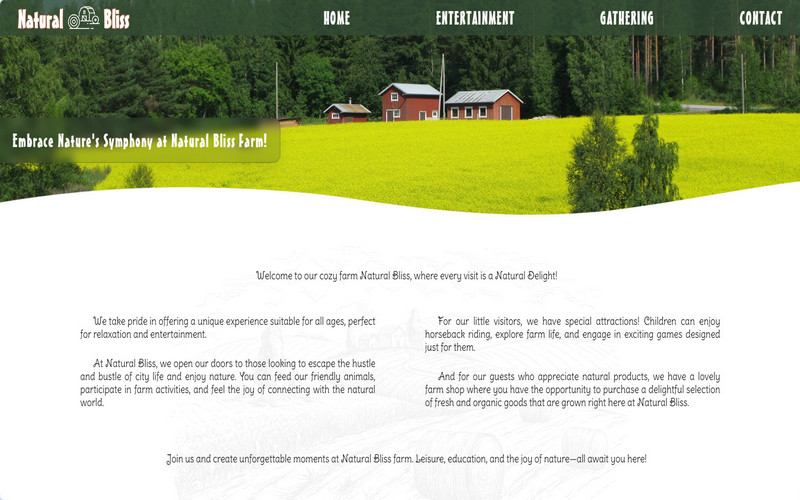

</img>

Mitt første møte med koding var for noen år siden, da jeg opprettet/tilpasset et nettgalleri ved hjelp av CSS, HTML, PHP og MySQL. Etter en kort periode innså jeg at jeg var mer interessert i funksjonaliteten enn i designet. Jeg studerte på egenhånd på fritiden og ble veldig fascinert av hva og hvordan det skjedde på den andre siden av skjermen. Det var da jeg innså at jeg ønsket å utvikle karrieren min i denne retningen.  

For noen måneder siden var jeg så heldig å bli med Kodehode, et frontend fokusert kurs,  og hoppet inn i dette  kaninhullet for koding og webutvikling. Kurset ga meg dypere (og mer relevant) kunnskap innen **CSS** og **HTML**. Jeg ble kjent med magien av **Javascript** og **React**.  Begynte å utforske **C#**, **.Net** og **SQL**. I tillegg lærte jeg om grunnleggende design i **Figma**.

Jeg er en nysgjerrig person og prøver alltid å forstå essensen. Mitt ønske er å fortsette å utvide horisonten min, finpusse kunnskapen og utvikle meg selv som en dyktig utvikler.
Koding fengsler og absorberer meg og tiden går forbi på et blunk. For å tømme hodet litt og gi hjernen hvile, liker jeg å jobbe med hendene på fritiden – fra broderi med nål i hånden, til å lage små møbler med sag og hammer.  

  
|       |      	|
|:---:	|:----	|
|    |  **React + Vite**  Applikasjonen i React som gjør en spørring mot Brønnøysundregistrene sitt API og presenterer en liste over bedriftene som ble funnet.  |
|    |   **HTML + CSS**  Open topic: to design a visually appealing, user-friendly website for client.  Chosen topic - Farm.  |
|     	|   **Javascript API - Group Project**   A website that displays information retrieved from an API AND/OR USES the information retrieved to display something.  	|
|     	|   **Vanilla Javascript**   Creating a soundboard with eventlisteners that are activated when pressing keyboard keys and style properly so it actually looks like a soundboard!  	|  

<!--  

</img>

<table style="border:0px;">
  <tr>
    <td>
      <a href="https://github.com/Inna-B10/Enhetsregisteret-project" target="_blank"></img></a>
    </td>
    <td>
      <b>React + Vite</b>  Applikasjonen i React som gjør en spørring mot Brønnøysundregistrene sitt API og presenterer en liste over bedriftene som ble funnet.
    </td>
  </tr>
  <tr>
    <td>
      <a href="https://github.com/Inna-B10/The-farm---Natural-Bliss" target="_blank"></img></a>
    </td>
    <td>
      **HTML + CSS**  Open topic: to design a visually appealing, user-friendly website for client.  Chosen theme - Farm.
    </td>
  </tr>
  
</table>

   
🛠 Jeg jobber for tiden med denne siden

**Inna-B10/Inna-B10** is a ✨ _special_ ✨ repository because its `README.md` (this file) appears on your GitHub profile.

Here are some ideas to get you started:

- 🔭 I’m currently working on ...
- 🌱 I’m currently learning ...
- 👯 I’m looking to collaborate on ...
- 🤔 I’m looking for help with ...
- 💬 Ask me about ...
- 📫 How to reach me: ...
- 😄 Pronouns: ...
- ⚡ Fun fact: ...
- 👋
  -->
