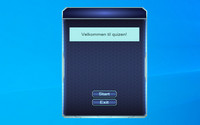
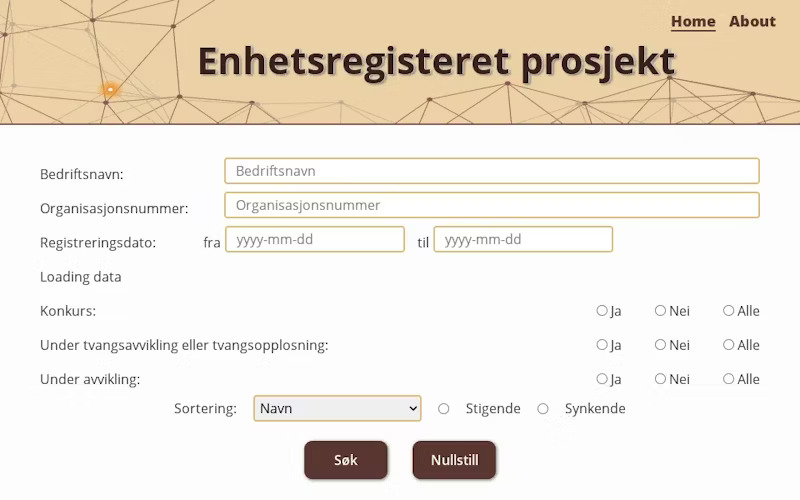
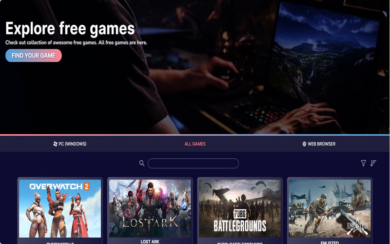
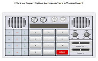
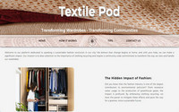
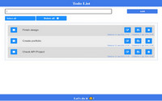

Mitt første møte med koding var for noen år siden, da jeg opprettet/tilpasset et nettgalleri ved hjelp av CSS, HTML, PHP og MySQL. Etter en kort periode innså jeg at jeg var mer interessert i funksjonaliteten enn i designet. Jeg studerte på egenhånd på fritiden og ble veldig fascinert av hva og hvordan det skjedde på den andre siden av skjermen. Det var da jeg innså at jeg ønsket å utvikle karrieren min i denne retningen.

For noen måneder siden var jeg så heldig å bli med Kodehode, et frontend fokusert kurs, og hoppet inn i dette kaninhullet for koding og webutvikling. Kurset ga meg dypere (og mer relevant) kunnskap innen **CSS** og **HTML**. Jeg ble kjent med magien av **Javascript** og **React**. Begynte å utforske **C#**, **.Net** og **SQL**. I tillegg har jeg lært om grunnleggende design i **Figma**.

Jeg er en nysgjerrig person og prøver alltid å forstå essensen. Mitt ønske er å fortsette å utvide horisonten min, finpusse kunnskapen og utvikle meg selv som en dyktig utvikler.
Koding fengsler og absorberer meg og tiden går forbi på et blunk. For å tømme hodet litt og gi hjernen hvile, liker jeg å jobbe med hendene på fritiden – fra broderi med nål i hånden, til å lage små møbler med sag og hammer.  
 

 <h3> Noe av mine prosjekter: </h3> 

 
 
|       |      	|
|:---:	|:----	|
|    | **Quiz** _(C#)_  En enkel C#-app som kjører quiz og viser resultatet til slutt. Utformet med Windows.Forms. [GitHub](https://github.com/Inna-B10/QuizFormApp) |
|    |  **Enhetsregisteret** _(React + Vite)_  Applikasjonen i React som gjør en spørring mot Brønnøysundregistrene sitt API og presenterer en liste over bedriftene som ble funnet. [GitHub](https://github.com/Inna-B10/Enhetsregisteret-project) \| [Netlify](https://enhetsregisteret-project.netlify.app/)  |
|    |   **Farm \"Natural Bliss\"** _(HTML + CSS)_  Open topic: design a visually appealing, user-friendly website for client.  Chosen topic - Farm. [Github](https://github.com/Inna-B10/The-farm---Natural-Bliss) \| [Netlify](https://natural-bliss-innab10.netlify.app/) |
|     	|   **Free games** _(Javascript API) Group Project_   A website that displays information retrieved from an API AND/OR USES the information retrieved to display something. [GitHub](https://github.com/Inna-B10/JS-API-PROJECT) \| [Netlify](https://js-api-group-project.netlify.app) 	|
|     	|   **Soundboard** _(Vanilla Javascript)_   Creating a soundboard with eventlisteners that are activated when pressing keyboard keys and style properly so it actually looks like a soundboard! [GitHub](https://github.com/Inna-B10/Soundboard) \| [Netlify](https://soundboard-innab10.netlify.app)  	|
|    	|   **TextilePod** _(HTML + CSS) Group Project_   An engaging and visually appealing homepage that introduces Textile POD using HTML, CSS. Mission of the business is to bring awareness in the city to recycle clothes. [GitHub](https://github.com/Inna-B10/Textile-Pod) \| [Netlify](https://textile-pod.netlify.app/)  	| 
|     	|   **Todo list** _(Vanilla Javascript)_   Todo List application using JavaScript, HTML and CSS. A user has the ability to add, edit, filter, and remove items from both the list and local storage. [GitHub](https://github.com/Inna-B10/Advanced-Todo-list) \| [Netlify](https://advanced-todo-list-my-innab10.netlify.app/) 	|

<!--

🛠 Jeg jobber for tiden med denne siden

**Inna-B10/Inna-B10** is a ✨ _special_ ✨ repository because its `README.md` (this file) appears on your GitHub profile.

Here are some ideas to get you started:

- 🔭 I’m currently working on ...
- 🌱 I’m currently learning ...
- 👯 I’m looking to collaborate on ...
- 🤔 I’m looking for help with ...
- 💬 Ask me about ...
- 📫 How to reach me: ...
- 😄 Pronouns: ...
- ⚡ Fun fact: ...
- 👋
  -->
